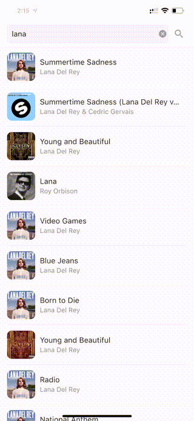

# Music player

## Compatibility
App has been tested in the following environments.
* Android min SDK 26, target SDK 29
* iOS 11+

## Build
* Simply run `flutter pub get` to get dependencies.

* Auto build is set up in Github Actions using Ubuntu 18, Java 12, Flutter 2.0+. 

* Tagged commit will trigger testing and building with a fat apk as artifact under Github project release page. Removing x86 support will greatly reduce the size.

* Build script is under `.github/workflows/main.yml`

## Features
* Search songs by keywords
* Click on a song will start to play, the player will show up at the bottom
  * A loading icon (in the list item) is displayed until caching is complete
  * An animated notation icon is next to the song
  * Start/pause, fast-forward
  * progress bar
* Click on the bottom of the player, detailed player will pop-up
  * A disc with artwork spins when playing, stops when paused/stopped
  * Jump to previous/next track
  * Can drag the progress bar to jump into an arbitrary location
* Did NOT add album name to the song list, however added for detailed player
* Not bug free

## Test
Due to limited time and other commitment, no comprehensive testing is provided. My apology.
